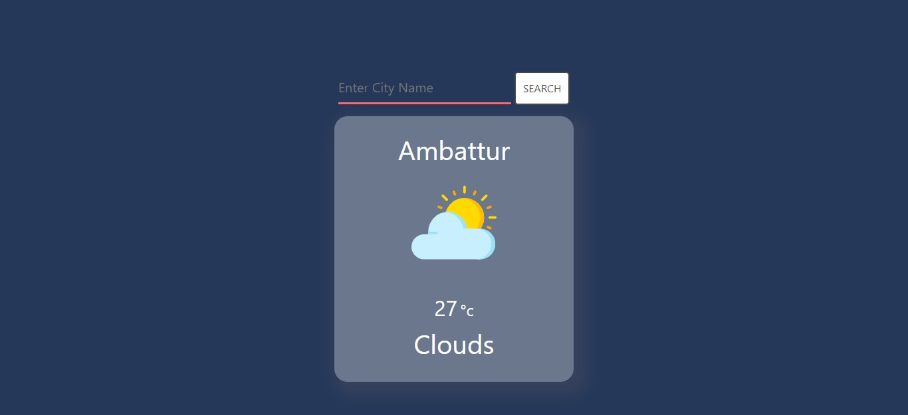

# Weather App

> This is a weather app where the user will be able to search the current weather with this one.

## Live Demo:

[Live Demo Link] )

##  Built with

- HTML5
- CSS3
- JavaScript
- Dom
- Open-weather-Api
- Linters
- VS code

##  Getting Started

To get a local copy up and running follow these simple steps:

1. Go to the [repository page](https://github.com/karthykarthick/weather-app).
2. Press the "Code" button and copy the link.
3. Clone it using git command `git clone <link>`.

## Author

👤 **Karthick**

- Github: [karthick](https://github.com/karthykarthick)
- Twitter: [@Karthic81367745](https://twitter.com/Karthic81367745)
- LinkedIn: [karthick harimoorthy](https://www.linkedin.com/in/karthick-harimoorthy/)

## 🤝 :raised_hand: :raised_hand: Contributions

Contributions, issues, and feature requests are welcome!

Feel free to check the [issues page](https://github.com/kcotrinam/weather-app/issues).

## :muscle: Show your support

Give a ⭐️ if you like this project!

## :grey_exclamation: Acknowledgment

- [Microverse](https://www.microverse.org/)
- [Odin Project](https://www.theodinproject.com/)
- Stand up teams

 ## 📝 License

This project is [MIT](LICENSE) licensed.